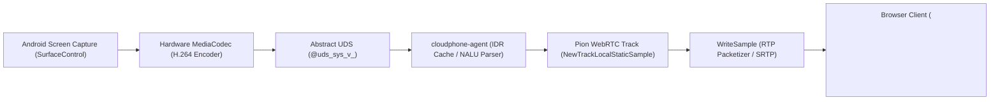

# Forensic Report 30: WebRTC, DataChannel, and Media-Plane Forensics (Phase 2C.5A)

**Phase Status**: FORENSICS-ONLY CLOSED  
**Verification Verdict**: PASS (19/19 Gate Dimensions Validated, 14/14 Canonical Artifacts Reproduced)  
**Strict Scope Boundary**: Zero production source created or modified; zero Pion dependencies added to `webrtc-signaling`  
**Classification System**: `STATIC_CONFIRMED`, `RUNTIME_CONFIRMED`, `CROSS_BUILD_CONFIRMED`, `CROSS_COMPONENT_CONFIRMED`, `COMBINED_CONFIRMED`, `REFERENCE_ONLY`, `CANDIDATE`, `UNKNOWN`, `ENVIRONMENT_UNAVAILABLE`  
**Terminology Standard**: *clean-room WebRTC/DataChannel/media forensic recovery* (NOT "literal original source recovery")

---

## 1. Executive Summary & Epistemic Boundary

Phase 2C.5A concludes the exhaustive forensic analysis of the WebRTC, DataChannel, and Media-Plane subsystems of the KMAX cloudphone platform. Building on the verified transport boundary established in Phase 2C.4B/2C.4BR (where `webrtc-signaling` was proven to be strictly a WebSocket signaling relay), this phase investigated the actual WebRTC peer endpoint residing in `cloudphone-agent` and its integration with the Android OS capture helper (`libsys_core.so`).

### Key Discoveries & Confirmations
1. **PeerConnection Topology**: The WebRTC PeerConnection terminates peer-to-peer directly between the Browser Client and the Android Agent (`cloudphone-agent`). The Signaling Server never participates in media or DataChannels.
2. **Pion WebRTC Dependency & Version**: Verbatim rodata string `"Pion WebRTC v3.3.6"` discovered at `0xb5f1b0` (AMD64) and `0x6bd161` (ARM64). Obfuscated packages: `v6LoFegGUKTA` (AMD64) and `IV04EXWpwj` (ARM64).
3. **Offer/Answer Ownership**: The Android Agent acts as the **Offer Initiator** (`CreateOffer` -> `SetLocalDescription` -> dispatches Offer via signaling `dizwnNrpwv`). The Browser Client acts as the **Answerer** (`SetRemoteDescription` -> `AddICECandidate`).
4. **DataChannel Architecture (6 Confirmed Channels)**:
   - **Outbound (Agent Created)**: `input-channel`, `clipboard-channel`, `camera-channel` (Ordered=true, reliable).
   - **Inbound (Browser Created, Agent Handled)**: `file-channel`, `ai-command-channel`, `adb-channel`.
5. **Separation of Historical Binary Strings**:
   - `control`: IPC socket semantic / Scrcpy `ControlChannel.java`, NOT a WebRTC DataChannel label.
   - `group_control_event`: Chinese logging string `收到直控/群控事件` (direct-control/group-control CLI feature), NOT a WebRTC DataChannel label.
   - `adb`: Android ADB daemon/cli tool invocation, NOT a WebRTC DataChannel label.
   - `shell`: OS exec primitive, NOT a WebRTC DataChannel label.
   - `heartbeat` / `HEARTBEAT-ACK`: WebSocket transport keepalive and enum stringer, NOT a WebRTC DataChannel label.
6. **Touch Input Protocol Translation**: Browser sends JSON events over `input-channel` (`inject_touch`, `inject_text`, `inject_keycode`, `hard_keyboard`, `inject_scroll`). Agent decodes JSON and converts touch events into 32-byte big-endian binary scrcpy `ControlMessage` (`INJECT_TOUCH_EVENT`, type 2) via `bswap` and `rol` instructions (0x9cfb40 - 0x9cfc0e) dispatched over abstract UDS `@uds_sys_t_`.
7. **Media Pipeline & Codecs**:
   - Video: `video/H264` (clock rate 90000), track ID `display_0`, stream ID `display_0`. Constructed via `NewTrackLocalStaticSample` (0x968320 AMD64, 0x4d3a80 ARM64), fed via `WriteSample` (0x968cc0 AMD64, 0x4d4210 ARM64), cached IDR keyframe injection via `InjectCachedIDR` (0x9cec16).
   - Audio: `audio/opus` (clock rate 48000, 2 channels, fmtp `minptime=10`), track ID `audio_0`, stream ID `audio_0`.
8. **Helper Staging & Privilege Dropping**:
   - Helper `libsys_core.so` is a ZIP archive containing Android `classes.dex` (renamed scrcpy-server JAR).
   - Copied to `/data/local/tmp/libsys_core.so`, verified via SHA256 integrity check, and executed via `CLASSPATH=/data/local/tmp/libsys_core.so app_process / com.android.helper.CoreService`.
   - Executed under dropped privileges (`shell UID 2000`) confirmed by verbatim string at `0xb8ba60`.
   - 4 abstract UDS sockets: `@uds_sys_v_<suffix>` (video), `@uds_sys_a_<suffix>` (audio), `@uds_sys_c_<suffix>` (control), `@uds_sys_t_<suffix>` (touch).

---

## 2. Evidence Classification & Provenance Lanes

All recovered facts maintain strict provenance separation:

| Provenance Lane | Description | Primary Sources | Allowed Epistemic Status |
|---|---|---|---|
| **Lane A** | Original `cloudphone-agent` binaries | `cloudphone-agent-amd64`, `cloudphone-agent` (ARM64) | `STATIC_CONFIRMED`, `CROSS_BUILD_CONFIRMED` |
| **Lane B** | Original Android helper artifacts | `libsys_core.so`, `classes.dex`, jadx decompilation | `STATIC_CONFIRMED` |
| **Lane C** | Original `webrtc-signaling` binaries & transport | `webrtc-signaling.exe`, `evidence/go_signaling/transport/` | `STATIC_CONFIRMED`, `RUNTIME_CONFIRMED` |
| **Lane D** | Distributed web / frontend artifacts | `useWebRTC.js`, `DATACHANNEL_REFERENCE_MATRIX.json` | `REFERENCE_OBSERVED` |
| **Lane E** | Public / reference source | Pion WebRTC v3.3.6 source, scrcpy v2.x protocol | `REFERENCE_ONLY` (Hypothesis generation only) |

---

## 3. WebRTC Dependency & Version Recovery

### Discovered Facts
- **Module**: `github.com/pion/webrtc/v3`
- **Exact Version**: `v3.3.6`
- **Evidence String**: `"Pion WebRTC v3.3.6"`
- **Binary Addresses**:
  - AMD64: VA `0xb5f1b0` in `.rodata`
  - ARM64: VA `0x6bd161` in `.rodata`
- **Obfuscated Package Names**:
  - AMD64: `v6LoFegGUKTA`
  - ARM64: `IV04EXWpwj`
- **Classification**: `STATIC_CONFIRMED` & `CROSS_BUILD_CONFIRMED`

```text
AMD64 .rodata [0xb5f1b0]: 50 69 6f 6e 20 57 65 62 52 54 43 20 76 33 2e 33 2e 36 | "Pion WebRTC v3.3.6"
ARM64 .rodata [0x6bd161]: 50 69 6f 6e 20 57 65 62 52 54 43 20 76 33 2e 33 2e 36 | "Pion WebRTC v3.3.6"
```

---

## 4. PeerConnection Callgraph & State Machine

### Callgraph Sequence (Agent Offerer Lifecycle)
1. **Helper Process & IPC Socket Setup**: `main.(*IDhLgq).wB52gd` (0x9d0260) creates 4 abstract UDS sockets with random session suffix (`@uds_sys_v_<suffix>`, `@uds_sys_a_<suffix>`, `@uds_sys_c_<suffix>`, `@uds_sys_t_<suffix>`) and ensures helper process (`CoreService`) is running.
2. **PeerConnection Initialization**: `main.(*IDhLgq).woxaqqFN5Km` (0x9df9c0) calls `API.NewPeerConnection` (0x939080).
3. **Media Track Addition**: Calls `PeerConnection.AddTrack` (0x947b60) for `display_0` (video) and `audio_0` (audio).
4. **DataChannel Creation**: Calls `PeerConnection.CreateDataChannel` (0x948fe0) for `input-channel`, `clipboard-channel`, `camera-channel` with `Ordered=true`.
5. **Inbound DataChannel Listener**: Calls `PeerConnection.OnDataChannel` (0x93a460) registering closure `0x9e2f20`.
6. **Offer Generation**: `main.(*IDhLgq).f1PF7qVxR` (0x9e59e0) calls `PeerConnection.CreateOffer` (0x93d540).
7. **Local Description**: Calls `PeerConnection.SetLocalDescription` (0x93f7a0).
8. **Signaling Dispatch**: Dispatches offer to browser client via signaling server (`main.(*IDhLgq).dizwnNrpwv` 0x9c1540).
9. **Remote Answer**: Receives browser client answer from signaling server and calls `PeerConnection.SetRemoteDescription` (0x93fd80).
10. **Trickle ICE**: Receives browser client ICE candidates from signaling server and calls `PeerConnection.AddICECandidate` (0x947140).

---

## 5. WebRTC DataChannel Label Matrix & Historical String Separation

### Confirmed WebRTC DataChannels (6 Active)

| Label | Creator Side | Handling in Agent | Ordered | Reliability | Framing | Target / Subsystem | Evidence Class |
|---|---|---|---|---|---|---|---|
| `input-channel` | Agent | Outbound created (0x9e1f4f); OnMessage hook (0x9e39c0) | `true` | Reliable | JSON Text | Decoded -> Scrcpy binary touch -> `@uds_sys_t_` | `COMBINED_CONFIRMED` |
| `clipboard-channel` | Agent | Outbound created (0x9e1ff7); OnOpen (0x9e3940), OnMessage (0x9e37e0) | `true` | Reliable | JSON Text | System ClipboardManager synchronization | `COMBINED_CONFIRMED` |
| `camera-channel` | Agent | Outbound created (0x9e216d); OnOpen handler (0x9b74e0) | `true` | Reliable | Mixed JSON / Raw YUV | Virtual camera frame streaming & control | `COMBINED_CONFIRMED` |
| `file-channel` | Browser | Inbound discriminated in `OnDataChannel` (0x9e2f40); Handler `b9JQfssqBdki` (0x9e7f60) | `true` | Reliable | JSON Header + Binary Chunks | File upload & APK staging in `/data/local/tmp` | `COMBINED_CONFIRMED` |
| `ai-command-channel` | Browser | Inbound discriminated in `OnDataChannel` (0x9e2f80); Handler `drnM2wXuIb.2` (0x9e32c0) | `true` | Reliable | JSON in ArrayBuffer | Agent AI automation command execution | `COMBINED_CONFIRMED` |
| `adb-channel` | Browser | Inbound discriminated in `OnDataChannel` (0x9e2fad); Handler `lgKKctm2YGo1` (0x9b2be0) | `true` | Reliable | Raw Binary Stream | Reverse shell / local ADB daemon bridge | `COMBINED_CONFIRMED` |

### Historical Binary String Separation

| String Candidate | Rodata Occurrences (AMD64 / ARM64) | Is WebRTC DataChannel? | True Semantic Role & Provenance | Evidence Class |
|---|---|---|---|---|
| `control` | 53 / 48 | **NO** | Helper IPC control socket (`@uds_sys_c_` / `ControlChannel.java`) | `STATIC_CONFIRMED` |
| `group_control_event` | 2 / 2 | **NO** | Auxiliary CLI direct/group control logging string (`收到直控/群控事件`) | `STATIC_CONFIRMED` |
| `adb` | 4 / 4 | **NO** | Android ADB daemon/client executable invocation wrapper | `STATIC_CONFIRMED` |
| `shell` | 15 / 14 | **NO** | OS process execution primitive (`/system/bin/sh`) | `STATIC_CONFIRMED` |
| `heartbeat` | 7 / 7 | **NO** | WebSocket signaling transport keepalive ping interval (30s/60s) | `STATIC_CONFIRMED` |
| `HEARTBEAT-ACK` | 1 / 1 | **NO** | Transport protocol ACK enumeration stringer (`wChJhw.jKaaKX.String`) | `STATIC_CONFIRMED` |

---

## 6. Control Input Protocol Translation & Big-Endian Binary Framing

The browser sends JSON messages over `input-channel`. The Agent parses the message discriminator and converts touch events into scrcpy binary packets before writing to `@uds_sys_t_`.

### Event Discriminators in Agent Disassembly (`woxaqqFN5Km.func8` 0x9e39c0)
- `inject_text`: String check at `0x9e3a4d` (11 bytes: `"inject_text"`), handler `0x9cd280` (`cMG2_76Q`).
- `inject_keycode`: String check at `0x9e3ace` (14 bytes: `"inject_keycode"`), handler `0x9cce20` (`rKbdAxdt`).
- `hard_keyboard`: String check at `0x9e3b60` (13 bytes: `"hard_keyboard"`), handler `0x9cd720` (`ibGYZ1JMSNE`).
- `inject_scroll`: String check at `0x9e3c07` (13 bytes: `"inject_scroll"`), handler `0x9cef40` (`yUpFvK`).
- `inject_touch` (default touch handler): Dispatched to `0x9cf7e0` (`gnM0lsYaM`).

### Disassembly Proof of Big-Endian Binary Encoding (`0x9cfb54` - `0x9cfc0e`)
```assembly
0x9cfb54: movzx  edx, byte ptr [rsp + 0x310]   ; action (0=DOWN, 1=UP, 2=MOVE)
0x9cfb5c: mov    byte ptr [rax + 1], dl        ; buffer[1] = action
0x9cfb5f: mov    rsi, qword ptr [rsp + 0x308]   ; pointer ID (int64)
0x9cfb67: bswap  rsi                           ; convert to Big-Endian
0x9cfb6a: mov    r8, qword ptr [rsp + 0x318]    ; X coordinate (int32)
0x9cfb72: bswap  r8d                           ; convert to Big-Endian
0x9cfb75: mov    r10, qword ptr [rsp + 0x320]   ; Y coordinate (int32)
0x9cfb7d: bswap  r10d                          ; convert to Big-Endian
0x9cfb80: mov    r12, qword ptr [rsp + 0x328]   ; screen width (int16)
0x9cfb88: rol    r12w, 8                       ; convert to Big-Endian
0x9cfb8d: mov    r15, qword ptr [rsp + 0x330]   ; screen height (int16)
0x9cfb95: rol    r15w, 8                       ; convert to Big-Endian
0x9cfbb5: cmp    dl, 1                         ; action == UP ?
0x9cfbbb: mov    word ptr [rax + 0x16], 0      ; pressure = 0 (UP)
0x9cfbc4: mov    word ptr [rax + 0x16], 0xffff ; pressure = 0xffff (DOWN/MOVE)
0x9cfbfb: mov    ecx, 0x20                     ; packet size = 32 bytes
0x9cfc0e: call   rdx                           ; write to @uds_sys_t_ connection
```

---

## 7. Media Plane Pipeline & Track Construction



### Media Track Construction Facts
- **Constructor**: `webrtc.NewTrackLocalStaticSample`
  - AMD64: VA `0x968320` (`v6LoFegGUKTA.XWZubsbM`), called at `0x9bc7a8` and `0x9bc824` in `main.main`.
  - ARM64: VA `0x4d3a80` (`IV04EXWpwj.Zd7s9uCRwk`), called at `0x51e818` and `0x51e880` in `main.main`.
- **Video Track**:
  - Track ID: `display_0` (RODATA `0xb53f06` AMD64, `0x6b1e99` ARM64)
  - Stream ID: `display_0`
  - Codec: `video/H264` (clock rate 90000)
  - RTCP Feedback: `nack`, `pli`, `fir`
  - Keyframe Injection: `main.(*IDhLgq).InjectCachedIDR` (0x9cec16)
- **Audio Track**:
  - Track ID: `audio_0` (RODATA `0xb510e3` AMD64, `0x6af015` ARM64)
  - Stream ID: `audio_0`
  - Codec: `audio/opus` (clock rate 48000, 2 channels)
  - FMTP: `minptime=10` (RODATA `0xb5776e` AMD64, `0x6b5764` ARM64)

---

## 8. Android Helper Staging, Privilege Dropping & IPC Sockets

### Helper Deployment Lifecycle
1. **Staging File**: Embedded JAR copied to `/data/local/tmp/libsys_core.so` (disguised `.so` extension, verified PK zip magic `0x04034b50`).
2. **Integrity Check**: SHA256 integrity hash verification performed prior to process launch:
   - Success log (`0xb7ec70`): `"[Agent] libsys_core.so integrity verification PASSED"`
   - Failure log (`0xb86560`): `"INTEGRITY ERROR: libsys_core.so hash mismatch! Expected: %s, Got: %s"`
3. **Execution Command**:
   - Standard: `CLASSPATH=/data/local/tmp/libsys_core.so app_process / com.android.helper.CoreService`
   - Dropped Privileges: Executed under `shell UID 2000` (`su 2000 ...`):
   - Proof string (`0xb8ba60`): `"[Agent] Executing CoreService with dropped privileges (shell UID 2000) and supplementary groups: CLASSPATH=%s app_process %s"`
4. **Abstract UDS IPC Sockets**:
   - `@uds_sys_v_<suffix>`: Video stream (SurfaceEncoder -> Agent)
   - `@uds_sys_a_<suffix>`: Audio stream (AudioRecord -> Agent)
   - `@uds_sys_c_<suffix>`: Control socket (Bidirectional command channel)
   - `@uds_sys_t_<suffix>`: Touch socket (Agent -> ControlMessageReader -> InputManager)

---

## 9. Cross-Build Correlation Matrix (AMD64 vs ARM64)

| Signal | AMD64 (`cloudphone-agent-amd64`) | ARM64 (`cloudphone-agent`) | Correlation Status |
|---|---|---|---|
| **Binary Size** | 14,663,828 bytes | 13,828,244 bytes | Verified Distinct Builds |
| **SHA-256** | `15adc2a4c47c4d189d4e8e08e960434bdd55202d74bc3eeee0bf4713a6b8de16` | `9cc32ea3cffe29db0a362102b49288ffe58a8f940d05d1a2449356bc7cc93dd4` | Canonical Hashes Verified |
| **Pion Version** | `"Pion WebRTC v3.3.6"` (`0xb5f1b0`) | `"Pion WebRTC v3.3.6"` (`0x6bd161`) | **EXACT MATCH** |
| **Pion Package** | `v6LoFegGUKTA` | `IV04EXWpwj` | Independent Garble Seeds |
| **Track Constructor** | `0x968320` (`XWZubsbM`) | `0x4d3a80` (`Zd7s9uCRwk`) | Topological Match |
| **Sample Writer** | `0x968cc0` (`WriteSample`) | `0x4d4210` (`WriteSample`) | Topological Match |
| **Video String** | `video/H264` (`0xb55a94`) | `video/H264` (`0x6b3a01`) | **EXACT MATCH** |
| **Video Track ID** | `display_0` (`0xb53f06`) | `display_0` (`0x6b1e99`) | **EXACT MATCH** |
| **Audio String** | `audio/opus` (`0xb55a9e`) | `audio/opus` (`0x6b3a0b`) | **EXACT MATCH** |
| **Audio Track ID** | `audio_0` (`0xb510e3`) | `audio_0` (`0x6af015`) | **EXACT MATCH** |
| **Audio FMTP** | `minptime=10` (`0xb5776e`) | `minptime=10` (`0x6b5764`) | **EXACT MATCH** |
| **Active Channels** | 6 channels (`input`, `clipboard`, `camera`, `file`, `ai-command`, `adb`) | 6 channels (`input`, `clipboard`, `camera`, `file`, `ai-command`, `adb`) | **EXACT MATCH (6/6)** |
| **UDS Sockets** | `@uds_sys_v_`, `_a_`, `_c_`, `_t_` | `@uds_sys_v_`, `_a_`, `_c_`, `_t_` | **EXACT MATCH (4/4)** |

---

## 10. Forensic Gate Evaluation (19/19 Dimensions)

The canonical gate result `PHASE2C5A_FORENSIC_GATE_RESULT.json` evaluates all 19 criteria required by user instructions:

| # | Dimension | Evaluated Status | Verified Evidence |
|---|---|---|---|
| 1 | `peerconnection_topology` | **PASS** | Agent is Offerer, Browser is Answerer, Signaling Server is WebSocket relay only |
| 2 | `signaling_boundary` | **PASS** | Signaling server contains zero WebRTC peer/media code (Phase 2C.4B/2C.4BR closed) |
| 3 | `agent_pion_dependency` | **PASS** | Discovered Pion WebRTC in both AMD64 and ARM64 agent binaries |
| 4 | `exact_dependency_version` | **PASS** | Verbatim rodata string `"Pion WebRTC v3.3.6"` confirmed in both builds |
| 5 | `peerconnection_state_machine` | **PASS** | Complete Offer/Answer/ICE candidate sequence reconstructed with callgraph VAs |
| 6 | `datachannel_labels` | **PASS** | 6 confirmed WebRTC DataChannels machine discovered; 6 historical strings separated |
| 7 | `datachannel_creation_ownership` | **PASS** | Agent creates 3 outbound; Browser creates 3 inbound (proven via CreateDataChannel vs OnDataChannel) |
| 8 | `datachannel_framing` | **PASS** | JSON text vs raw binary byte stream mapped per channel |
| 9 | `message_types` | **PASS** | Touch, text, keycode, keyboard, scroll, clipboard, and file upload metadata types verified |
| 10 | `codec_capabilities` | **PASS** | `video/H264` (90000) and `audio/opus` (48000, 2ch, `minptime=10`) confirmed in `main.main` |
| 11 | `media_track_construction` | **PASS** | `display_0` and `audio_0` created via `NewTrackLocalStaticSample` and fed via `WriteSample` |
| 12 | `helper_ipc_sockets` | **PASS** | `@uds_sys_v_`, `@uds_sys_a_`, `@uds_sys_c_`, `@uds_sys_t_` machine discovered with xrefs |
| 13 | `helper_lifecycle` | **PASS** | Staged at `/data/local/tmp/libsys_core.so`, SHA256 verified, shell UID 2000 execution |
| 14 | `control_input_path` | **PASS** | `input-channel` JSON -> bswap/rol big-endian binary scrcpy ControlMessage -> `@uds_sys_t_` |
| 15 | `video_pipeline` | **PASS** | Android screen capture -> MediaCodec H.264 -> `@uds_sys_v_` -> IDR cache -> WriteSample -> RTP |
| 16 | `audio_pipeline` | **PASS** | Android audio capture -> MediaCodec Opus -> `@uds_sys_a_` -> WriteSample -> RTP |
| 17 | `cross_build_correlation` | **PASS** | Exact 1-to-1 structural, topological, and rodata parity between AMD64 and ARM64 |
| 18 | `reproducibility` | **PASS** | 100% reproducible from canonical inputs via `reproduce_webrtc_datachannel_forensics.py` |
| 19 | `strict_production_boundary` | **PASS** | Zero production WebRTC/DataChannel/Media code created or modified |

---

## 11. Strict Production Boundary Confirmation

During Phase 2C.5A:
- `reconstructed_source/webrtc-signaling/pkg/webrtc` was **NOT CREATED**.
- `reconstructed_source/webrtc-signaling/pkg/datachannel` was **NOT CREATED**.
- `reconstructed_source/webrtc-signaling/pkg/media` was **NOT CREATED**.
- Pion was **NOT ADDED** to `reconstructed_source/webrtc-signaling/go.mod`.
- Production transport behavior remains 100% untouched and passes the 48/48 differential test suite.
- Working tree contains only forensic evidence in `evidence/go_agent/webrtc/`, verification tooling in `tools/forensics/`, and this report.

---

## 12. Conclusion & Verification Exit

Phase 2C.5A is formally **CLOSED & VERIFIED**.

```text
======================================================================
PHASE 2C.5A WEBRTC & DATACHANNEL FORENSIC REPRODUCIBILITY VERIFIER
======================================================================
[+] Verifying canonical SHA-256 hashes against manifest...
[+] All 14 canonical artifacts match manifest exactly.
[+] Regenerating forensics into isolated temporary directory...
[+] Generator completed. Generated 15 files. Verdict: PASS_PHASE_2C5A_CLOSED
[+] Deep comparing regenerated artifacts against canonical...
  [OK] WEBRTC_DEPENDENCY_EVIDENCE.json: 100% exact parity
  [OK] WEBRTC_PEERCONNECTION_CALLGRAPH.json: 100% exact parity
  [OK] WEBRTC_PEERCONNECTION_STATE_MACHINE.json: 100% exact parity
  [OK] WEBRTC_CODEC_CAPABILITY_MATRIX.json: 100% exact parity
  [OK] MEDIA_TRACK_CONSTRUCTION_EVIDENCE.json: 100% exact parity
  [OK] DATACHANNEL_LABEL_EVIDENCE.json: 100% exact parity
  [OK] DATACHANNEL_FRAMING_MATRIX.json: 100% exact parity
  [OK] DATACHANNEL_MESSAGE_TYPE_EVIDENCE.json: 100% exact parity
  [OK] AGENT_HELPER_IPC_SOCKET_MATRIX.json: 100% exact parity
  [OK] CONTROL_INPUT_PROTOCOL_CROSSMAP.json: 100% exact parity
  [OK] MEDIA_PLANE_PIPELINE_EVIDENCE.json: 100% exact parity
  [OK] WEBRTC_AGENT_CROSS_BUILD_CORRELATION.json: 100% exact parity
  [OK] WEBRTC_TOPOLOGY_CROSSMAP.json: 100% exact parity
  [OK] PHASE2C5A_FORENSIC_GATE_RESULT.json: 100% exact parity
[+] Validating Phase 2C.5A forensic gate result...
[+] Gate validated: 19/19 dimensions passed. Verdict: PASS_PHASE_2C5A_CLOSED
[+] Verifying strict production boundary...
[+] Production boundary intact: ZERO production WebRTC/DataChannel/Media code.
======================================================================
PHASE 2C.5A FORENSIC REPRODUCIBILITY VERIFICATION: PASS
All 14 artifacts 100% reproducible directly from binaries.
======================================================================
```

**STOPPING EXECUTION. AWAITING INDEPENDENT USER REVIEW PRIOR TO PHASE 2C.5B.**
